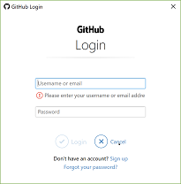

[](https://classroom.github.com/online_ide?assignment_repo_id=6745294&assignment_repo_type=AssignmentRepo)
# hw01

This assignment is used to gain experience with version control systems, i.e., `git` and sites that are used to host versioned projects, e.g., [GitHub](https://github.com).

In Lab0a (`git-github-essentials-your-github-username`), you accepted a GitHub Classroom assignment that linked you to our GitHub Classroom. The repository itself contained material that provided background information surrounding the use of version control systems like `git` and sites that host repositories (e.g., GitHub). In this assignment, you'll put some of these concepts to practice through some "typical" changes that are made to software development projects (e.g., updating existing files and adding new files to version control).

**Please note**: 

* This assignment has been re-used for several semesters and as such, there may be some screen snapshots that appear different from your experience. If this descrepency creates any confusion for you, please raise an issue here: [https://github.com/msu-csc232-sp22/hw01/issues](https://github.com/msu-csc232-sp22/hw01/issues). Some semesters it was used as a non-graded lab; this semester we're using this as our first graded homework assignment.
* This lab is reused each semester, so some (if not all, by now) screen snapshots will appear to reference these previous semesters.

## Goals

Upon completion of this assignment, the student will have learned or continued to gain experience on how to

* accept a GitHub Education assignment
* clone a repository from GitHub
* create a development branch within in which to do their work
* create a pull request to complete an assignment

## Prerequisites

Before a student can proceed with this assignment, the student must have

* signed up for a GitHub account
* installed `git` on their computer

If you use a Windows machine, `git` is easily installed by downloading `git` for Windows here: [https://gitforwindows.org/](https://gitforwindows.org/). There are many alternatives, but this is a very common one and mirrors a program installed on our lab machines. All `git` commands presented in this README are executed, for example, in the `Git Bash` console window.

Furthermore, you'll want to check out these videos hosted on YouTube. The following were located by simply searching for "GitHub & Git Foundations" on YouTube.

* [What is GitHub?](https://www.youtube.com/watch?time_continue=8&v=w3jLJU7DT5E) (3:45)
* [GitHub Training & Guides](https://www.youtube.com/user/GitHubGuides)
  * Getting Started/Setup
    * [Intro](https://www.youtube.com/watch?v=FyfwLX4HAxM&list=PLDx-eoZGKRiH1S5l82vzLtoiuKqTLH9yN) (4:04)
    * [Setup](https://www.youtube.com/watch?v=7Inc0G0wutk&list=PLKtIksTx7tTpxy5Gw7itc0zdgZtaLHWW0) (2:15)
    * [Config](https://www.youtube.com/watch?v=ZChtKFLiaNw) (2:48)
  * Fundamentals (Operations we'll use most often)
    * [Branch](https://www.youtube.com/watch?v=H5GJfcp3p4Q) (2:25)
    * [Checkout](https://www.youtube.com/watch?v=HwrPhOp6-aM) (3:11)
    * [Commit](https://www.youtube.com/watch?v=A-Cll9jEnnM) (4:08)
    * [Pull Requests](https://www.youtube.com/watch?v=d5wpJ5VimSU) (4:26)
    * [Merge](https://www.youtube.com/watch?v=yyLiplDQtf0) (4:50)
    * [GUI](https://www.youtube.com/watch?v=BMYOs5jflGE) (3:47)
  * Additional, useful operations
    * [Ignore](https://www.youtube.com/watch?v=4VBG9FlyiOw&t=6s) (3:06)
    * [Diff](https://www.youtube.com/watch?v=RXSriVcoI70) (3:33)
    * [Log](https://www.youtube.com/watch?v=Ew8HQsFyVHo) (4:57)
    * [Rebase](https://www.youtube.com/watch?v=SxzjZtJwOgo&frags=pl%2Cwn) (4:20)
    * [Remove](https://www.youtube.com/watch?v=jtuHOIlfS2Q) (3:30)
    * [Move](https://www.youtube.com/watch?v=ipdgyfPq8FE) (5:16)
* [Git and GitHub Crash Course For Beginners](https://www.youtube.com/watch?v=SWYqp7iY_Tc&t=18s) (32:41)

## Background Information

### Accepting GitHub Assignments

With each assignment in CSC232, students are given a URL that must be followed. When the student follows the given URL, a process is kicked off wherein a new repository is created in their GitHub account. Once the repository is created by this background process, the student may clone the repository and work with it as required.

If this is the first time you've accepted a GitHub Classroom Assignment Link, there are a few steps that you must do that are required to link your GitHub account with the course GitHub classroom. _In fact, a similar step was taken in Lab0a whose primary purpose in the lab was to establish that link_. The following section (Linking your account) need only be followed **if and only if** this is the first GitHub Classroom Assignment Link you've followed.

#### Linking your account

This assignment assumes (and in fact requires) that you have a GitHub account. Visit [GitHub Education](https://education.github.com/students) to get started. 

1. Once you have a created a GitHub account, log into [github.com](https://github.com). 
1. Once you are logged into GitHub, accept this assignment by visiting [https://classroom.github.com/a/3JHZP56Y](https://classroom.github.com/a/3JHZP56Y). Again, since is the first time, you'll encounter the some facsimile of the following pages: 

   

   As the image suggests, locate _your_ name and tap on the arrow to the right.

   After you select your name, you should encounter the confirmation pop-up:

   

   Tapping the OK button then takes you to this page:

   

   You are now ready to accept the assignment (and be linked to the course GitHub Classroom); just make sure that the end of the repo matches your GitHub username before you tap on the "Accept this assignment" button.

   Once you accept the assignment, you'll get a confirmation screen of it's creation. At this point, a background process is creating the repo in your GitHub account.

   

   Wait a bit (no more than a minute) and refresh that confirmation page. After refreshing, you should see the following page:

   

   Following the link will take you to your newly created repository. Do that now and continue reading this README.

### Cloning a GitHub Repository

Cloning a repository is rather simple. When viewing a GitHub repository online, there is a green button that provides you with the URL needed to clone the repository, as something similar shown here:


When you tap on that button, you actually have two different options for cloning, either via SSH or via HTTPS. While using SSH is more secure, it takes some additional configuration on your part that is beyond the scope of this assignment. As such, you'll want to select HTTPS.

Once you have obtained the repository's URL, cloning is done by simply executing the following `git` command:

```bash
git clone https://github.com/msu-csc232-sp22/hw01-intro-to-git-your-github-username.git
```

Please note the following:

1. The above command assumes the name of the repository is `hw01-intro-to-git-your-github-username`. When your instructor creates assignments, they'll always have a prefix like `hw01-intro-to-git` (for hw01, an introduction to git) followed by a hyphen followed by your GitHub username. As such, you shouldn't type that command verbatim. Instead, substitute the URL following the word `clone` with whatever you copied by tapping on the clone button on your repository when viewewd online in GitHub.
1. Before issuing this `git` command, it is assumed you have navigated to the folder in which you want this repository cloned. For example, before doing this, you may want to create a "working" directory for this class with the following commands:

```bash
$ mkdir -p csc232/lab
$ cd csc232/lab
$ git clone https://github.com/msu-csc232-sp22/hw01-intro-to-git-your-github-username.git
Cloning into 'hw01-intro-to-git-your-github-username.git'...
remote: Counting objects: 5, done.
remote: Compressing objects: 100% (5/5), done.
remote: Total 5 (delta 0), reused 0 (delta 0), pack-reused 0
Unpacking objects: 100% (5/5), done.
$ cd hw01-intro-to-git-your-github-username
```

Again, in the above commands, one does not type the `$`. Any lines shown without the leading `$` are output from one of the commands. Also, when executing the `git` command, you may be prompted to (minimally) log in to GitHub as shown here:



Also, if you've set up two-factor authentication (something you should do with any online accounts that offer it, including social media like Facebook) you may be prompted for secondary authentication as shown here:


When you're all said and done, you'll be in the csc232/lab/hw0a-intro-to-git-your-github-username directory. This cloned directory is what will be referred to as your "working directory."

### Creating a develop branch

With each assignment, you will be required to create a `develop` branch within which to do your work. Creating the `develop` branch will allow you to create a _pull request_ which will be the manner in which you submit your assignments.

Creating a `develop` branch is easy. Assuming you're in your "working directory" for the assignment and you've just cloned this repository for the first time, issuing the following `git` commands will yield something like:

```bash
$ git status
On branch trunk
Your branch is up to date with 'origin/trunk'.

nothing to commit, working tree clean

$ git checkout -b develop
Switched to a new branch 'develop'

$ git branch
* develop
  trunk

$
```

In the above, we see three new `git` commands:

1. `git status` will tell you what branch your on and whether or not there are changes to be committed.
1. `git checkout -b` is actually two commands in one: the `checkout` portion is how you switch to a different branch; the `-b` switch is used to create the branch first. If you already have the branch, we do this command with out the `-b` to switch to the desired branch.
1. `git branch` shows the branches that currently exist in your local repository. The one with the leading `*` is the branch that is currently checked out.

### Modifying Existing Files and Commiting Changes

Now that we have a `develop` branch to work in, let's modify an existing [file](version.txt). In this repository is a file named `version.txt`. The contents of this file can be seen with the `cat` command in the Git Bash console window:

```bash
$ cat version.txt
Version: 0.0

$
```

Open this file using Notepad and change version number to be 1.0. You can easily open Notepad using the following command:

```bash
$ notepad version.txt
$
```

Make the change, save the file and close Notepad. (If you are using a non-Windows machine, just open this file with your favorite text editor.)

Now that this file has changed, we want to _commit_ this change. This is easily done as follows:

```bash
$ git commit -am "Updated version number."
[trunk 7333fbb] Updated version number.
 1 file changed, 1 insertion(+), 1 deletion(-)
$
```

Note:

* the "commit hash" (`7333fbb`) is unique to this example; it'll most likely be different on your machine.
* The `-am` switches on the `git commit` command serve two purposes: the `a` part serves to "stage" this file for commits and the `m` portion serves to indicate a commit message that must accompany every commit. If you leave off the `m` portion, you'll find yourself in a weird editor (named `vi`) whose usage is beyond the scope of this assignment.

### Adding New Files Under Revision Control and Commiting Changes

Sometimes you'll find the need to _add_ new files to a repository. In order for these new files to be recognized under the `git` version control system, we have to _stage_ the file. This too, is pretty simple. Let's use Notepad to create a new file named `bio.md`:

```bash
$ notepad bio.md
$
```

The above command will launch Notepad. You may be prompted to "bind" `bio.md`; just select "Yes" in the dialogue box presented by Notepad. (And again, if you're using a non-Windows machine, just use your favorite text editor to create this file.)

The `md` extention on this file suggests it is in the Markdown format. You don't have to style the file using Markdown (you can just write plain text for now), but you are encourage to learn the Markdown syntax as this is the "standard" format for README files (and other documentation hosted in version control systems like GitHub, BitBucket and the like). Here's a [cheat sheet](https://guides.github.com/pdfs/markdown-cheatsheet-online.pdf) specific to GitHub that may be used to help with the Markdown syntax.

What should be written? Your instructor would like to know more about you; what's your background, what's your major, why did you pick your major etc. Your instructor also likes to be humored, so tell him something funny. None of this has to be real; it's up to you as to what you want to say here. You could also tell him things you like (music, football, etc.). It is rumored that he gives bonus points for anything positive said about the Buffalo Bills. This can be as long (or as short) as you desire; it could be as close or as far as possible from reality. The content is not important; it's the skill of adding a new file to your repository.

When you're all done, _save_ your changes, _add_ and _commit_ them under revision control:

```bash
$ git add bio.md
$ git commit -m "Initial import of bio."
... some output regarding changes and modes created
$
```

### Pushing Your Work to GitHub

At this point, we have made several changes to the contents of our repository under the `develop` branch. We have:

* _edited/modified_ a file and commited those changes
* _created_ a new file, _added_ it revision control and committed the changes in this new file

Now it's time to _push_ these changes back to GitHub. We'll do this using the `git push` command. However, since we've created this `develop` branch locally on our computer, GitHub knows nothing about this branch. As such, with this _first_ push to GitHub, we have to tell GitHub to create a similarly named branch and set up _tracking_ between GitHub's `develop` branch and our local `develop` branch. We do this by using the `--set-upstream origin develop` switch with the `git push` command as follows:

```bash
$ git push --set-upstream origin develop
Counting objects: 6, done.
Delta compression using up to 4 threads.
Compressing objects: 100% (5/5), done.
Writing objects: 100% (6/6), 2.26 KiB | 578.00 KiB/s, done.
Total 6 (delta 3), reused 0 (delta 0)
remote: Resolving deltas: 100% (3/3), completed with 2 local objects.
To github.com:msu-csc232/hw0a-intro-to-git-your-github-username.git
 * [new branch]      develop -> develop
Branch 'develop' set up to track remote branch 'develop' from 'origin'.

$
```

Any subsequent push does not require the `--set-upstream` switch (and in fact, it shouldn't be used once it's been used once already). That is, all subsequent pushes merely require that you type `git push` at the command line.

### Creating a Pull Request

When we're done, the `develop` branch will be different from the `trunk` branch. These differences amount to the work you've done. A _pull request_ is issued to ask others to review these changes before they're _merged_ into the `trunk` branch. In other words, your "requesting" to "pull" the changes you've made into the `trunk` branch; hence the name _pull request_.

Before a pull request can be created, we have two more things to do. We have to

1. _commit_ the changes we've made in this `develop` branch.
1. _push_ our changes to GitHub.

As we've just done this, we can issue our pull request. Back on GitHub, our repository has a "Pull Request" tab as shown below:


Tap on the New Pull Request button and make sure you are comparing your `develop` branch with your `trunk` branch as shown below:


Note the direction of the arrow: _from_ `develop` _into_ `trunk`. Tap on the Pull Request button and fill in a brief description. Also, add `professordaehn` as a reviewer and assign yourself the Assignee. Once you've added in all these details, tap on the Create Pull Request button.

Once you've done this, _do not merge_ until your instructor as approved the pull request.

## Tasks

To complete this assignment, one must:

1. Accept the assignment delivered to you (i.e., visit the URL given)
1. Clone their `hw01-intro-to-git-*` repository.
1. Create a `develop` branch within in which to do your work.
1. Modify a [file](version.txt) with a simple change and commit your changes.
1. Create a new file in which you'll write a brief bio and outline your expectations for the class.
1. Add the new file to version control and commit your changes.
1. Push your changes to GitHub.
1. Create a pull request requesting to merge your changes in your `develop` branch into your `trunk` branch. (This pull request must have "professordaehn" added as a reviewer.)

## Submission Details

As usual, prior to submitting your assignment to Blackboard, be sure that you have committed and pushed your final changes to GitHub. Submit the URL of your assignment _repository_ (i.e., _not_ the URL of the pull request) as a Text Submission in Blackboard. Please note: the timestamp of the submission on Blackboard is used to assess any late penalties if and when warranted.

### Due Date

Your Blackboard submission is due by **11:59 PM, 27-Jan 2022**.

### Grading Rubric

This assignment is worth **5 points**.

Criteria          | Exceeds Expectations         | Meets Expectations                  | Below Expectations                  | Failure                                                 |
------------------|------------------------------|-------------------------------------|-------------------------------------|---------------------------------------------------------|
Pull Request (20%)| Submitted early, correct url | Submitted on-time; correct url      | Incorrect URL                       | No pull request was created or submitted                |
Code Style^ (20%)  | Exemplary code style         | Consistent, modern coding style     | Inconsistent coding style           | No style whatsoever or no code changes present          |
Correctness^^ (60%)| All unit tests pass          | At least 80% of the unit tests pass | At least 60% of the unit tests pass | Less than 50% of the unit tests pass                    |

^ _There is no coding in this homework assignment, but this criteria is presented (and used) here as this is a general rubric used for homework assignments and labs_. _For this assignment, you can count on full credit here_.

^^ _The Google Test unit runner, if appropriate, will calculate the correctness points based purely on the fraction of tests passed_.

### Late Penalty

* In the first 24 hour period following the due date, this homework assignment will be penalized 1 point meaning the grading starts at 4 (out of 5 total possible) points.
* In the second 24 hour period following the due date, this homework assignment will be penalized 2 points meaning the grading starts at 3 (out of 5 total possible) points.
* After 48 hours, the assignment will not be graded and thus earns no points, i.e., 0 out of 5 possible points.

## Disclaimer & Fair Use Statement

This repository may contain copyrighted material, the use of which may not have been specifically authorized by the copyright owner. This material is available in an effort to explain issues relevant to the course or to illustrate the use and benefits of an educational tool. The material contained in this repository is distributed without profit for research and educational purposes. Only small portions of the original work are being used and those could not be used to easily duplicate the original work.

This constitutes a 'fair use' of any such copyrighted material (referenced and provided for in section 107 of the US Copyright Law).

If you wish to use any copyrighted material from this repository for purposes that go beyond 'fair use', you must obtain expressed permission from the copyright owner.

## Issues

If you have found any issues with this lab, e.g., the output of a command didn't match yours, or you have found typos, or one or more sections are worded in a manner that seems confusing or misleading, please bring it to my attention. The best way to do that is to "raise an Issue." Visit [https://github.com/msu-csc232-sp22/hw01/issues](https://github.com/msu-csc232-sp22/hw01/issues) and tap on the "New Issue" button.
