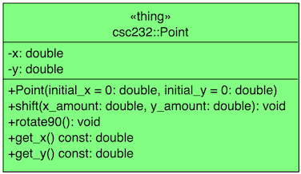

[](https://classroom.github.com/online_ide?assignment_repo_id=7018281&assignment_repo_type=AssignmentRepo)
# HW02 - Classes and Parameters

This assignment provides the student with the opportunity to utilize various parameter and return passing idioms while furthering their understanding of C++ Classes.

## Background

To put theory to practice, in this assignment we seek to model a "point" located in a 2-dimensional Cartesian plane. We shall do this by developing a `Point` class. This new class is a data type to store and manipulate the location of a single point on a plane. The `Point` class has the following member functions:

- There is a constructor to initialize a point. The constructor's parameters use default arguments.
- There is a member function to shift a point by a given amount along the _x_ and _y_ axes.
- There is a member function to rotate a point by 90° in a clockwise direction around the origin.
- There are two constant member functions that allow us to retrieve the current _x_ and _y_ coordinates of a `Point`.

These functions are simple, yet they form the basis for an actual data type that is used in drawing programs and other graphics applications.

Below is a UML class diagram for the class you'll implement in Task 1.



**Figure 1**: UML class diagram of the `Point` class.

### Additional Suggested Reading

- [Naming Conventions in C++](https://www.geeksforgeeks.org/naming-convention-in-c/)
- [Google C++ Style Guide](https://google.github.io/styleguide/cppguide.html)
- [Appendix A.9 C++ Classes](https://online.vitalsource.com/reader/books/9780134477473/epubcfi/6/446%5B%3Bvnd.vst.idref%3DP7001011925000000000000000006803%5D!/4/2%5BP7001011925000000000000000006803%5D/16%5BP7001011925000000000000000006A37%5D/2/2%5BP700101192500000000000000000E3A8%5D/3:6%5Bass%2Ces%5D), specifically, A.9.1-A.9.3
- [Appendix C The Unified Modeling Language](https://online.vitalsource.com/reader/books/9780134477473/epubcfi/6/470%5B%3Bvnd.vst.idref%3DP7001011925000000000000000006EDF%5D!/4/2%5BP7001011925000000000000000006EDF%5D)

## Objective

Upon successful completion of this assignment, the student has learned how to

- declare and define a new class given sufficient specifications
- implement functions that have its parameters
  - passed by value
  - passed by reference
  - passed by constant reference
- implement functions that return values by value
  
## Getting Started

After accepting this assignment with the provided [GitHub Classroom Assignment link](https://classroom.github.com/a/zQCAPjrK), clone this repository. If you have cloned the repository from the command line prompt, navigate into the newly created directory

```bash
cd hw02-github-username
```

Next, create a branch named `develop`. Please note: The name of this branch **must** be as specified and will be, to the grading scripts, case-sensitive.

```bash
git checkout -b develop
```

Make sure you are on the `develop` branch before you get started. Make all your commits on the `develop` branch.

```bash
git branch
```

_You may have to type the `q` character to get back to the command line prompt after viewing the branches._

Finally, setup remote tracking with the following `push` command.

```bash
git push -u origin develop
```

Recall, you only add the `-u origin develop` the _first_ time you push a new (local) branch. All subsequent directions to push to GitHub will simply be `git push`.

## Tasks

There are five tasks in this homework assignment:

1. Implement the `Point` class
2. Work with value parameters
3. Work with reference parameters
4. Work with constant reference parameters
5. Work with return passing (by value)

For this assignment, the first task will require that you create two new files (`point.h` and `point.cpp`). For the remaining tasks, your coding will take place in the [csc232.h](include/csc232.h) header file.

## Task 1 - The Point Class

Steps:

1. Begin by toggling the `WORKING_ON_TASK1` macro definition from `FALSE` to `TRUE` (this is case-sensitive).
2. Create a new file: `point.h` in the `include` folder.
3. Declare the `Point` class in this new header file. The declaration should be made _within_ the `csc232` namespace. Furthermore, surround your declaration with a multiple-inclusion macro guard:

   ```c++
   #ifndef CSC232_POINT_H
   #define CSC232_POINT_H

   namespace csc232
   {
      class Point
      {
      public:
         // ... declare public members here accordingly
      private:
         // ... decare private members here accordingly
      };
   }

   #endif
   ```

4. Create a new file: `point.cpp` in the `src` folder.
5. Stub out the point class operations in this new source file (make sure you have `#include "point.h"` before your stubbed-out operations). Recall a _stub_ is just the minimal implementation needed to get the file to compile. For `void` functions, an empty body will suffice; for methods that return `double`, simply returning `0` is sufficient.
6. Add `#include "point.h"` to `csc232.h` (just after the `#include "expanded_templates.h"` entry)
7. Update the `CMakeLists.txt` to include these new files in the `main` and `tests` targets (see lines 41 & 43):

   ```text
   set(SRC_MAIN_FILES include/csc232.h src/main.cpp include/point.h src/point.cpp)
   set(SRC_TEST_FILES test/tests.cpp include/point.h src/point.cpp)
   ```

8. Build and execute the `main` target. Once you can build this target, go back to your member function definitions and implement them as specified (consult the Development Notes below if needed).
9. When your code compiles, builds and executes properly, toggle the `TASK1_COMPLETED` macro definition from `FALSE` to `TRUE` (this is case-sensitive).
10. Verify your member function implementations by building and running the `tests` target (or by running `ctest`); see the [guidelines for testing](test/TESTING.md) for more details.
11. Once you are satisfied with your test results, be sure to stage (using `git add`), commit (using `git commit` with an appropriate commit message) and push (using `git push`) your changes to GitHub.

**Note**: In the remaining tasks, we implement **non-member** functions. These are functions that are defined outside of the `Point` class declaration (hence the label "non-member"). These functions utilize the `Point` class with the different parameter-passing idioms discussed in class:

- pass-by-value
- pass-by-reference
- pass-by-constant-reference

The remaining tasks have you editing the [include/csc232.h](include/csc232.h) header file.
  
## Task 2 - Working with Value Parameters

Steps:

As suggested by the title of this task, this function demonstrates the use of the pass-by-value parameter passing mechanism. A **value parameter** is declared by writing the type name followed by the parameter name. With a value parameter, the argument argument provides the initial value for the formal parameter. The value parameter is implemented as a local variable of the function, so that any changes made to the parameter in the body of the function will leave the argument unaltered.

1. Toggle the `WORKING_ON_TASK2` macro definition from `FALSE` to `TRUE` (this is case-sensitive).
2. Locate the `TODO: Define int rotations_needed(Point p) below`.
3. Using the following specification, implement this non-member function where indicated

   ```c++
   /**
     * @brief Calculate the number of 90° rotations needed to move a Point to
     * the first quadrant.
     * 
     * @param p the Point under interrogation
     * @return the number of 90° rotations needed to move p to the first quandrant
     * @post The value returned is the number of 90° clockwise rotations needed to
     * move p into the first quadrant (where x >= 0 and y >= 0).
     */
   int rotations_needed(Point p);
   ```

4. When you are ready to test your solution, toggle the `TASK2_COMPLETED` macro definition from `FALSE` to `TRUE` (this is case-sensitive).
5. Verify your function implementation by building and running the `tests` target (or by running `ctest`); see the [guidelines for testing](test/TESTING.md) for more details.
6. Once you are satisfied with your test results, be sure to stage (using `git add`), commit (using `git commit` with an appropriate commit message) and push (using `git push`) your changes to GitHub.

## Task 3 - Working with Reference Parameters

As suggested by the title of this task, this function demonstrates the use of the pass-by-reference parameter passing mechanism. A **reference parameter** is declared by writing the type name followed by the character `&` and the parameter name. With a reference parameter, any of the parameter withing the body of the function will access the argument from the calling program. Changes made to the formal parameter in the body of the function will alter the argument.

Steps:

1. Toggle the `WORKING_ON_TASK3` macro definition from `FALSE` to `TRUE` (this is case-sensitive).
2. Locate the `TODO: Define void rotate_to_upper_right(Point& p) below`.
3. Using the following specification, implement this non-member function where indicated

   ```c++
   /**
     * @brief Rotate a point through a series of 90° clockwise rotations until the
     * given point is located in the first quadrant.
     * 
     * @param p the Point under interrogation
     * @post The Point p has been rotated into the first quadrant (where x >= 0 and y >= 0).
     */
   void rotate_to_upper_right(Point& p);
   ```

4. When you are ready to test your solution, toggle the `TASK3_COMPLETED` macro definition from `FALSE` to `TRUE` (this is case-sensitive).
5. Verify your function implementation by building and running the `tests` target (or by running `ctest`); see the [guidelines for testing](test/TESTING.md) for more details.
6. Once you are satisfied with your test results, be sure to stage (using `git add`), commit (using `git commit` with an appropriate commit message) and push (using `git push`) your changes to GitHub.

## Task 4 - Working with Constant Reference Parameters

As suggested by the title of this task, this function demonstrates the use of the pass-by-const-reference parameter passing mechanism. A **const reference parameter** is declared by writing the keyword `const` before a reference parameter and placing `&` after the parameter's type. The parameter is efficient, but unlike an ordinary reference parameter, the function cannot attempt to make any changes to the value of the parameter.

Note: this now is the third context in which we've used the `const` keyword:

- As a declared constant, e.g.,

  ```c++
  const int NUM_ROWS{16};
  ```

- Marking constant member functions (e.g., accessors), e.g.,

  ```c++
  double get_x() const;
  ```

- Marking reference parameters as const reference parameters (as we just discussed)

Steps:

1. Toggle the `WORKING_ON_TASK4` macro definition from `FALSE` to `TRUE` (this is case-sensitive).
2. Locate the `TODO: Define double distance(const Point& p1, const Point& p2) below`.
3. Using the following specification, implement this non-member function where indicated

   ```c++
   /**
     * @brief Calculate the distance between two points.
     * 
     * @param p1 one point of reference
     * @param p2 the other point of reference
     * @return the distance between points p1 and p2
     * @post The value returned is the distance between points p1 and p2. Library used: cmath
     */
   double distance(const Point& p1, const Point& p2);
   ```

4. When you are ready to test your solution, toggle the `TASK4_COMPLETED` macro definition from `FALSE` to `TRUE` (this is case-sensitive).
5. Verify your function implementation by building and running the `tests` target (or by running `ctest`); see the [guidelines for testing](test/TESTING.md) for more details.
6. Once you are satisfied with your test results, be sure to stage (using `git add`), commit (using `git commit` with an appropriate commit message) and push (using `git push`) your changes to GitHub.

## Task 5 - Return Passing By Value

The type of a function's return value may be a class. In this task, you'll implement one such function: a function that calculates the midpoint of two point objects. The midpoint is itself a point. This function will use data from the two supplied points to compute, i.e., create, a new (local) `Point` object. The function ultimately returns this `Point` object. In so doing, a _copy_ of the local variable (i.e., `Point` object) is made and returned.

As we'll see when we learn about _copy constructors_, the C++ `return` statement _uses_ the copy constructor to copy the function's return value to a temporary location before returning the value to the calling program.

Steps:

1. Toggle the `WORKING_ON_TASK5` macro definition from `FALSE` to `TRUE` (this is case-sensitive).
2. Locate the `TODO: Define Point middle(const Point& p1, const Point& p2) below`.
3. Using the following specification, implement this non-member function where indicated

   ```c++
   /**
     * @brief Find a point halfway between two points in a Cartesan plane.
     * 
     * @param p1 one point of reference
     * @param p2 the other point of reference
     * @return a Point that is halfway between p1 and p2.
     * @post The value returned is the Point halfway between p1 and p2.
     */
    Point middle(const Point& p1, const Point& p2);
   ```

4. When you are ready to test your solution, toggle the `TASK5_COMPLETED` macro definition from `FALSE` to `TRUE` (this is case-sensitive).
5. Verify your function implementation by building and running the `tests` target (or by running `ctest`); see the [guidelines for testing](test/TESTING.md) for more details.
6. Once you are satisfied with your test results, be sure to stage (using `git add`), commit (using `git commit` with an appropriate commit message) and push (using `git push`) your changes to GitHub.

## Additional Development Notes

The following notes serve as a guide to your development of the above tasks. Take particular note of the operation specifications as they can be used directly in Step 3 of Task 1.

### Point Constructor

- The `Point` constructor is an initializing constructor that takes two parameters (passed by value) that correspond to the _x_- and _y_-coordinates of the point. Use the values of these parameters to initialize the `Point` data members with an _initializer list_.
- Default values are specified in the class declaration found in the header file; they are not present in the implementation (source) file.

```c++
   /**
    * @brief Construct a new Point object.
    * 
    * @param initial_x the x-coordinate of this Point
    * @param initial_y the y-coordinate of this Point
    * @post This point has been set to (initial_x, initial_y)
    */
   explicit Point(double initial_x = 0.0, double initial_y = 0.0);
```

Since both parameters include default values, there exists the _potential_ for the use of a single-argument constructor. Therefore, we _should_ include the `explicit` keyword in its declaration.

**Default Arguments**: A default argument is a value that will be used for an argument when no actual argument is provided. The usage follows the format and rules listed here:

Syntax in a prototype's parameter list:

```text
<typename> <variable name> = <default value>
```

Example:

```c++
int date_check(int year, int month = 1, int date = 1);
```

1. The default argument is specified only once--in the prototype--and not in the function's implementation.
2. A function with several arguments does not need to specify default arguments for every argument. But if only some of the arguments have defaults, then those arguments must be right-most in the parameter list.
3. In a function call, arguments with default values may be omitted from the right end of the actual argument list. For example,

   ```c++
   int result;
   result = date_check(2000);        // use default arguments for month = 1x and date = 1
   result = date_check(2000, 7);     // uses default argument for date = 1
   result = date_check(2000, 7, 22); // does not use the default arguments at all
   ```

### Point Mutator Operations

The `Point` class contains two member functions that are considered _mutator_ methods as they can change the state of the object.

#### Shifting a Point

- A point is moved, or shifted, by changing its x- and/or y-coordinates. The arguments to this member function are merely added to the existing/corresponding _x_- and _y_-coordinates.

```c++
   /**
    * @brief Translate this Point along the x- and y-axes.
    * 
    * @param x_amount the amount to translate along the x-axis
    * @param y_amount the amount to translate along the y-axis
    * @post The point has been moved by x_amount along the x-axis
    * and by y_amount along the y_axis
    */
   void shift(double x_amount, double y_amount);
```

#### Rotating a Point Clockwise by 90°

- For a 90° clockwise rotation, the new _x_ is the original _y_, and the new _y_ is -1 times the original _x_.

```c++
   /**
    * @brief Rotate this point clockwise by 90° around the origin.
    * 
    * @post This Point has been rotated clockwise by 90° around the origin.
    s */
   void rotate90();
```

### Point Accessor Operations

The `Point` class contains two member functions that are considered _accessor_ methods. As such, they should not change the state of the object when invoked. To enforce this behavior, accessor methods are declared as `const` methods.

- Accessor methods that merely return the value of an encapsulated data member, the method often is given the `get` prefix (as we see in the class diagram shown above)
- The functions should be nothing more than a `return` statement returning the value of the corresponding data member.

```c++
   /**
    * @brief x-coordinate accessor.
    * 
    * @return the x-coordinate of this Point
    */
   double get_x() const;

   /**
    * @brief y-coordinate accessor.
    * 
    * @return the y-coordinate of this Point 
    */
   double get_y() const;
```

## Submission Details

As usual, prior to submitting your assignment to Blackboard, be sure that you have commited and pushed your final changes to GitHub. Once your final changes have been pushed, create a pull request that seeks to merge the changes in your `develop` branch into your `trunk` branch. Once your pull request has been created, submit the URL of your assignment _repository_ (i.e., _not_ the URL of the pull request) as a Link Resource in Blackboard. Please note: the timestamp of the submission on Blackboard is used to assess any late penalties if and when warrented, _not_ the date/time you create your pull request. **No more exceptions will be granted for this oversight**.

### Due Date

Your Blackboard submission is due by 11:59 PM, on 20 Feb 2022.

### Grading Rubric

This assignment is worth **5 points**.

All homework assignments are graded on the following general rubric:

- (Up to) 1 point is earned for creating the pull request and submitting your repositories URL into the Blackboard assignment by the due date.
- (Up to) 1 point is earned for proper coding style
- (Up to) 3 points are earned for program correctness; the points are determined by the degree to which your solution passes the unit tests.

### Late Penalty

In the first 24 hour period following the due date, this lab will be penalized 1 point meaning the grading starts at 4 (out of 5 total possible) points.

In the second 24 hour period following the due date, this lab will be penalized 2 points meaning the grading starts at 3 (out of 5 total possible) points.

After 48 hours, the assignment will not be graded and thus will not earn any points, i.e., your grade will be 0 out of 5 possible points.
