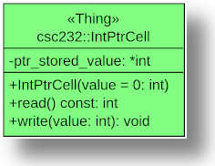

[](https://classroom.github.com/online_ide?assignment_repo_id=7049575&assignment_repo_type=AssignmentRepo)
# LAB03 - Translating UML Class Diagrams and the Big-Five

A quasi-test-driven approach to translating a UML class diagrams into C++ classes.

## Background

Before proceeding with this lab, the student should take the time to read

* Lecture notes (these links are repurposed from a previous semester, so ignore references to dates and/or lecture numbers)
  * [C++ Classes](https://github.com/msu-csc232-fa19/lectures/blob/master/lecs/lec03-cpp-classes.md)
  * [C++ Details (Part 1)](https://github.com/msu-csc232-fa19/lectures/blob/master/lecs/lec04-pointers-param-passing.md)
  * [C++ Details (Part 2)](https://github.com/msu-csc232-fa19/lectures/blob/master/lecs/lec05-param-passing-return-passing.md)
  * [C++ Details (Part 3)](https://github.com/msu-csc232-fa19/lectures/blob/master/lecs/lec06-the-big-five.md)
* Chapter 1 - Data Abstraction: The Walls (pp. 1-26, Carrano/Henry)
* C++ Interlude 1: C++ Classes (pp. 31-46, Carrano/Henry)
* Any prerequisites cited in the above chapters

## Objective

Upon successful completion of this lab, the student has learned how to

* translate a UML class diagram into a C++ class
* separate class specificaitons from their implementaitons
* specify declarations of the big-five

## Getting Started

After accepting this assignment with the provided [GitHub Classroom Assignment link](https://classroom.github.com/fill-me-in), clone this repository. If you have cloned the repository from the command line prompt, navigate into the newly created directory

```bash
cd lab03-github-username
```

Next, create a branch named `develop`. Please note: The name of this branch **must** be as specified and will be, to the grading scripts, case-sensitive.

```bash
git checkout -b develop
```

Make sure you are on the `develop` branch before you get started. Make all your commits on the `develop` branch.

```bash
git branch
```

_You may have to type the `q` character to get back to the command line prompt after viewing the status._

## Tasks

This lab consists of three tasks:

1. Stub out a class specification
1. Adding Big-Five Operations
1. Contextualize the Big-Five

### Task 1: Stub out a class specificaiton

In this first task, we stub out the class specified by the following UML class diagram.



**Figure 1**: `IntPtrCell` class diagram.

Notice, this is a slight modification of the `IntCell` class we covered in lecture earlier in the semester. The only difference here is that the data member is no longer an `int`, but rather, now it is a _pointer_ to an `int`.

#### Steps

1. Toggle `STARTED_TASK1` to TRUE (in the `include/csc232.h` header file).
1. Create a new header (file) named `int_ptr_cell.h` in the `include` folder with the following contents:
   
    ```c++
    #ifndef CSC232_INT_PTR_CELL_H
    #define CSC232_INT_PTR_CELL_H

    namespace csc232
    {
        class IntPtrCell
        {
        public:
        private:
        };
    }

    #endif // CSC232_INT_PTR_CELL_H
    ```

    **NOTE**: At this point, all we've done is to _declare_ a new class named `IntPtrCell` encapsulated in the `csc232` namespace.

1. Create a new implementation file named `int_ptr_cell.cpp` in the `src` folder with the following contents:

    ```c++
    #include "int_ptr_cell.h"
    ```

1. Update `csc232.h` by adding the same `#include "int_ptr_cell.h"` just after `#include "expanded_templates.h"`.
1. Update `CMakeLists.txt` file so that this new class is used to help build the `main` and `tests` targets.

    ```cmake
    set(SRC_MAIN_FILES src/main.cpp include/csc232.h include/int_ptr_cell.h src/int_ptr_cell.cpp)
    set(SRC_TEST_FILES test/test.cpp include/csc232.h include/int_ptr_cell.h src/int_ptr_cell.cpp)
    ```
1. Verify your work thus far by building the `main` target. At this point, you may notice the following warning:

    ```bash
    [build] ../src/main.cpp: In function ‘int main()’:
    [build] ../src/main.cpp:17:24: warning: unused variable ‘cell’ [-Wunused-variable]
    [build]    17 |     csc232::IntPtrCell cell;
    [build]       |                        ^~~~
    [build] [2/2 100% :: 0.889] Linking CXX executable main
    [build] Build finished with exit code 0
    ```

    You can safely ignore the warning (if you get one) for the `unused variable ‘cell’ [-Wunused-variable]`

1. Using **Figure 1** as your guide, go back and declare the member data and member functions accordingly in the `include/int_ptr_cell.h` header file:

    ```c++
    namespace csc232
    {
        class IntPtrCell
        {
        public:
            explicit IntPtrCell(int value = 0);
            int read() const;
            void write(int value);
        private:
            int * ptr_stored_value;
        };
    }
    ```

1. Next, complete the class definition in the `src/int_ptr_cell.cpp` implementation file. Notice the use of the initializer list in the constructor definition, and in particular, how it initializes the pointer data member with the give `init_value`):

    ```c++
    namespace csc232
    {
        IntPtrCell::IntPtrCell(int init_value) : ptr_stored_value{ new int(init_value) }
        {
            // intentionally empty
        }

        int IntPtrCell::read() const
        {
            // NOTE: Since ptr_stored_value is a pointer, we must dereference the pointer
            // in order to return the integer to which it points
            return *ptr_stored_value;
        }

        void IntPtrCell::write(int value)
        {
            // NOTE: We deference the pointer before we assign it a new int value
            *ptr_stored_value = value;
        }
    }
    ```

1. Toggle `COMPLETED_TASK1` to TRUE (in the `include/csc232.h` header file).
1. Build, link and execute the `main` target to verify your updates. Your output should be (at this point):

    ```text
    Hello, Main!
    Starting on Task 1...
    And now that Task 1 is complete, we have...
    0
    5

    ```

1. Once you successfully execute the `main` target with the expected output, stage (using `git add`), commit (using `git commit`), and push (using `git push`) your changes to GitHub.

### Task 2: Adding Big-Five Operations

1. Toggle `STARTED_TASK2` to TRUE (in the `include/csc232.h` header file).
1. Add Big-Five declarations to the `IntPtrCell` declaration (in the `include/int_ptr_cell.h` header file), using `default` implementations.

    ```c++
    namespace csc232
    {
        class IntPtrCell
        {
        public:
            explicit IntPtrCell(int value = 0);
            IntPtrCell(const IntPtrCell & src) = default;
            IntPtrCell(IntPtrCell&& src) = default;
            IntPtrCell& operator=(const IntPtrCell & rhs) = default;
            IntPtrCell& operator=(IntPtrCell&& rhs) = default;
            ~IntPtrCell() = default;
            int read() const;
            void write(int value);
        private:
            int * ptr_stored_value;
        };
    }
    ```

1. Build, link and execute the `main` target to verify your updates. Your output should be:

    ```text
    Hello, Main!
    Starting on Task 1...
    And now that Task 1 is complete, we have...
    0
    5
    Starting on Task 2...
    2
    2
    2
    5
    5
    5
    ```

    Does the output surprise you? It should...

1. Remove `default` implementations (from the header file `include/int_ptr_cell.h`) and add proper implementations in the implementation file (`src/int_ptr_cell.cpp`)

    ```c++
    IntPtrCell::IntPtrCell(int init_value) : ptr_stored_value{ new int(init_value) }
    {
        // intentionally empty
    }

    IntPtrCell::IntPtrCell(const IntPtrCell & src) : ptr_stored_value{ new int{ *src.ptr_stored_value } }
    {
        // intentionally empty; notice the use of the initializer list^^^
    }

    IntPtrCell::IntPtrCell(IntPtrCell&& src) : ptr_stored_value{ src.ptr_stored_value }
    {
        // intentionally empty; notice the use of the initializer list^^^
    }

    IntPtrCell& IntPtrCell::operator=(const IntPtrCell & rhs)
    {
        if ( this != &rhs) // check for self-assignment
        {
            // update only if we are not using self-assignment
            *ptr_stored_value = *rhs.ptr_stored_value;
        }
        return *this;
    }

    IntPtrCell& IntPtrCell::operator=(IntPtrCell&& rhs)
    {
        std::swap( ptr_stored_value, rhs.ptr_stored_value );
        return *this;
    }

    IntPtrCell::~IntPtrCell()
    {
        delete ptr_stored_value;
    }

    int IntPtrCell::read() const
    {
        return *ptr_stored_value;
    }

    void IntPtrCell::write(int value)
    {
        *ptr_stored_value = value;
    }
    ```

1. Toggle `COMPLETED_TASK2` to TRUE (in the `include/csc232.h` header file).
1. Build, link and execute the `main` target to verify your updates. Your output should be (at this point):

    ```text
    Hello, Main!
    Starting on Task 1...
    And now that Task 1 is complete, we have...
    0
    5
    Starting on Task 2...
    2
    2
    2
    5
    2
    2

    ```

    Notice the difference now? Our custom definitions of the Big-Five have addressed our problems arising from a _shallow_ copy of the data member.

1. Once you successfully execute the `main` target with the expected output, stage (using `git add`), commit (using `git commit`), and push (using `git push`) your changes to GitHub.

### Task 3: Contextualize the Big-Five

In this final task, we'll add some `cout` statements to our Big-Five implementations to get a feel for when they're used by C++.

1. Toggle `STARTED_TASK3` to TRUE (in the `include/csc232.h` header file).
1. Add `cout` statements to each of the Big-Five operations:

    ```c++
    namespace csc232
    {
        IntPtrCell::IntPtrCell(int init_value) : ptr_stored_value{ new int(init_value) }
        {
            // intentionally empty
            std::cout << "Default/Initializing Constructor invoked! (init_value: " << init_value << ")\n";
        }

        IntPtrCell::IntPtrCell(const IntPtrCell & rhs) : ptr_stored_value{ new int{ *rhs.ptr_stored_value } }
        {
            // intentionally empty
            std::cout << "Copy Constructor invoked! (rhs value: " << *rhs.ptr_stored_value << ")\n";
            ptr_stored_value = new int{ *rhs.ptr_stored_value };
        }

        IntPtrCell::IntPtrCell(IntPtrCell&& rhs) : ptr_stored_value{ rhs.ptr_stored_value }
        {
            std::cout << "Move Constructor invoked! (rhs value: " << *rhs.ptr_stored_value << ")\n";
            rhs.ptr_stored_value = nullptr;
        }

        IntPtrCell& IntPtrCell::operator=(const IntPtrCell & rhs)
        {
            std::cout << "Copy assignment operator invoked! (rhs value: " << *rhs.ptr_stored_value << ")\n";
            if ( this != &rhs)
            {
                *ptr_stored_value = *rhs.ptr_stored_value;
            }
            return *this;
        }

        IntPtrCell& IntPtrCell::operator=(IntPtrCell&& rhs)
        {
            std::cout << "Move assignment operator invoked! (rhs value: " << *rhs.ptr_stored_value << ")\n";
            std::swap( ptr_stored_value, rhs.ptr_stored_value );
            return *this;
        }

        IntPtrCell::~IntPtrCell()
        {
            if (ptr_stored_value != nullptr)
                std::cout << "Destructor invoked on ptr_stored_value pointing to " << *ptr_stored_value << "\n";
            else
                std::cout << "Destructor invoked; ptr_stored_value was moved and thus set to the nullptr\n";
            delete ptr_stored_value;
        }

        int IntPtrCell::read() const
        {
            return *ptr_stored_value;
        }

        void IntPtrCell::write(int value)
        {
            *ptr_stored_value = value;
        }
    }
    ```

1. Build, link, and execute the `main` target to verify your updates. Your output should be (at this point):

    ```text
    Hello, Main!
    Starting on Task 1...
    Default/Initializing Constructor invoked! (init_value: 0)
    And now that Task 1 is complete, we have...
    0
    5
    Starting on Task 2...
    Default/Initializing Constructor invoked! (init_value: 2)
    Copy Constructor invoked! (rhs value: 2)
    Default/Initializing Constructor invoked! (init_value: 0)
    Copy assignment operator invoked! (rhs value: 2)
    2
    2
    2
    5
    2
    2
    Starting on Task 3...
    Move assignment operator invoked! (rhs value: 2)
    Destructor invoked on ptr_stored_value pointing to 300
    Destructor invoked on ptr_stored_value pointing to 200
    Destructor invoked on ptr_stored_value pointing to 100
    Destructor invoked on ptr_stored_value pointing to 5
    ```

1. As a final test of your Big-Five implementations, toggle the `COMPLETED_TASK3` macro defintion to `TRUE` and build, link, and execute the `tests` target. If successful, your output should be some facsimile of the following:

    ```text
    Running main() from _deps/googletest-src/googletest/src/gtest_main.cc
    [==========] Running 8 tests from 1 test suite.
    [----------] Global test environment set-up.
    [----------] 8 tests from BigFiveTestSuite
    [ RUN      ] BigFiveTestSuite.CopyConstructorTest
    Default/Initializing Constructor invoked! (init_value: 5)
    Copy Constructor invoked! (rhs value: 5)
    Destructor invoked on ptr_stored_value pointing to 5
    Destructor invoked on ptr_stored_value pointing to 5
    [       OK ] BigFiveTestSuite.CopyConstructorTest (0 ms)
    [ RUN      ] BigFiveTestSuite.CopyConstructorCreatesDistinctObjectTest
    Default/Initializing Constructor invoked! (init_value: 5)
    Copy Constructor invoked! (rhs value: 5)
    Destructor invoked on ptr_stored_value pointing to 5
    Destructor invoked on ptr_stored_value pointing to 5
    [       OK ] BigFiveTestSuite.CopyConstructorCreatesDistinctObjectTest (0 ms)
    [ RUN      ] BigFiveTestSuite.MoveConstructorTest
    Default/Initializing Constructor invoked! (init_value: 5)
    Default/Initializing Constructor invoked! (init_value: 5)
    Destructor invoked on ptr_stored_value pointing to 5
    Destructor invoked on ptr_stored_value pointing to 5
    [       OK ] BigFiveTestSuite.MoveConstructorTest (0 ms)
    [ RUN      ] BigFiveTestSuite.MoveConstructorCreatesDistinctObjectTest
    Default/Initializing Constructor invoked! (init_value: 5)
    Move Constructor invoked! (rhs value: 5)
    Destructor invoked on ptr_stored_value pointing to 5
    Destructor invoked; ptr_stored_value was moved and thus set to the nullptr
    [       OK ] BigFiveTestSuite.MoveConstructorCreatesDistinctObjectTest (0 ms)
    [ RUN      ] BigFiveTestSuite.CopyAssignmentOperatorTest
    Default/Initializing Constructor invoked! (init_value: 5)
    Default/Initializing Constructor invoked! (init_value: 0)
    Copy assignment operator invoked! (rhs value: 5)
    Destructor invoked on ptr_stored_value pointing to 5
    Destructor invoked on ptr_stored_value pointing to 5
    [       OK ] BigFiveTestSuite.CopyAssignmentOperatorTest (0 ms)
    [ RUN      ] BigFiveTestSuite.CopyAssignmentOperatorDifferentObjectsTest
    Default/Initializing Constructor invoked! (init_value: 5)
    Default/Initializing Constructor invoked! (init_value: 0)
    Copy assignment operator invoked! (rhs value: 5)
    Destructor invoked on ptr_stored_value pointing to 5
    Destructor invoked on ptr_stored_value pointing to 5
    [       OK ] BigFiveTestSuite.CopyAssignmentOperatorDifferentObjectsTest (0 ms)
    [ RUN      ] BigFiveTestSuite.MoveAssignmentOperatorTest
    Default/Initializing Constructor invoked! (init_value: 0)
    Default/Initializing Constructor invoked! (init_value: 5)
    Move assignment operator invoked! (rhs value: 5)
    Destructor invoked on ptr_stored_value pointing to 0
    Destructor invoked on ptr_stored_value pointing to 5
    [       OK ] BigFiveTestSuite.MoveAssignmentOperatorTest (0 ms)
    [ RUN      ] BigFiveTestSuite.MoveAssignmentOperatorDifferentObjectsTest
    Default/Initializing Constructor invoked! (init_value: 5)
    Default/Initializing Constructor invoked! (init_value: 0)
    Move assignment operator invoked! (rhs value: 5)
    Destructor invoked on ptr_stored_value pointing to 5
    Destructor invoked on ptr_stored_value pointing to 0
    [       OK ] BigFiveTestSuite.MoveAssignmentOperatorDifferentObjectsTest (0 ms)
    [----------] 8 tests from BigFiveTestSuite (0 ms total)

    [----------] Global test environment tear-down
    [==========] 8 tests from 1 test suite ran. (0 ms total)
    [  PASSED  ] 8 tests.
    ```

1. Once you successfully execute the `tests` target with the expected output, stage (using `git add`), commit (using `git commit`), and push (using `git push`) your changes to GitHub.

## Submission Details

Before submitting your assignment, be sure you have pushed all your changes to GitHub.

```bash
git push
```

As usual, prior to submitting your assignment on Blackboard, be sure that you have committed and pushed your final changes to GitHub. Once your final changes have been pushed, create a pull request that seeks to merge the changes in your `develop` branch into your `trunk` branch. Once your pull request has been created, submit the URL of your assignment _repository_ (i.e., _not_ the URL of the pull request) Blackboard using a Text Submission. Please note: the timestamp of the submission on Blackboard is used to assess any late penalties if and when warranted, _not_ the date/time you create your pull request. **No exceptions will be granted for this oversight**.

### Due Date

Your assignment submission is **due by 11:59 PM, Saturday, 19-Feb-2022**.

### Grading Rubric

This assignment is worth **3 points**.

Criteria          | Exceeds Expectations        | Meets Expectations             | Below Expectations | Failure                                                 |
------------------|-----------------------------|--------------------------------|--------------------|---------------------------------------------------------|
Pull Request (20%)| Submitted early, correct url| Submitted on-time; correct url | Incorrect URL            | No pull request was created or submitted          |
Code Style (20%)  | Exemplary code style        | Consistent, modern coding style    | Inconsistent coding style| No style whatsoever or no code changes present|
Correctness^ (60%)| All unit tests pass         | At least 80% of the unit tests pass| At least 60% of the unit tests pass| Less than 50% of the unit tests pass|

^ _The Google Test unit runner will calculate the correctness points based purely on the fraction of tests passed_.

### Late Penalty

* In the first 24 hour period following the due date, this lab will be penalized 0.6 point meaning the grading starts at 2.4 (out of 3 total possible) points.
* In the second 24 hour period following the due date, this lab will be penalized 1.2 points meaning the grading starts at 1.8 (out of 3 total possible) points.
* After 48 hours, the assignment will not be graded and thus earns no points, i.e., 0 out of 3 possible points.
